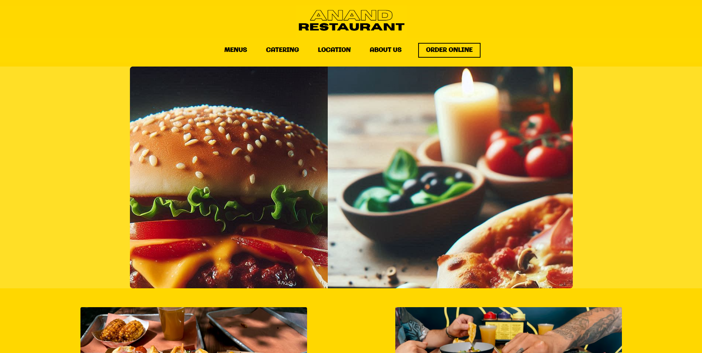
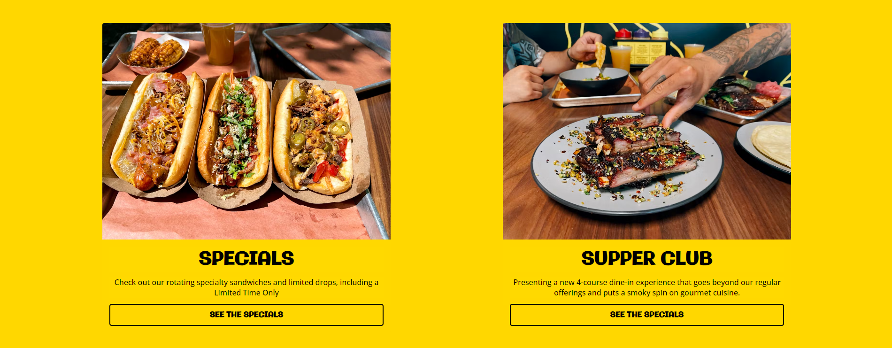
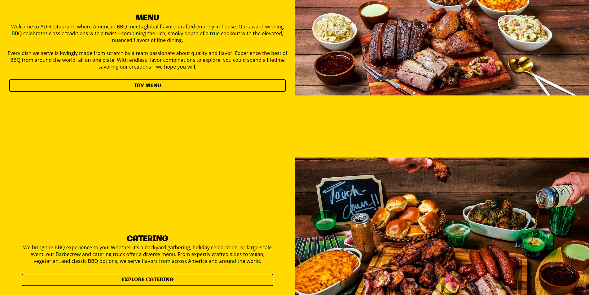
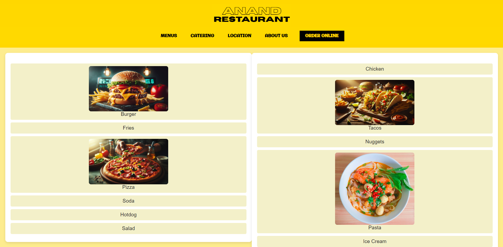
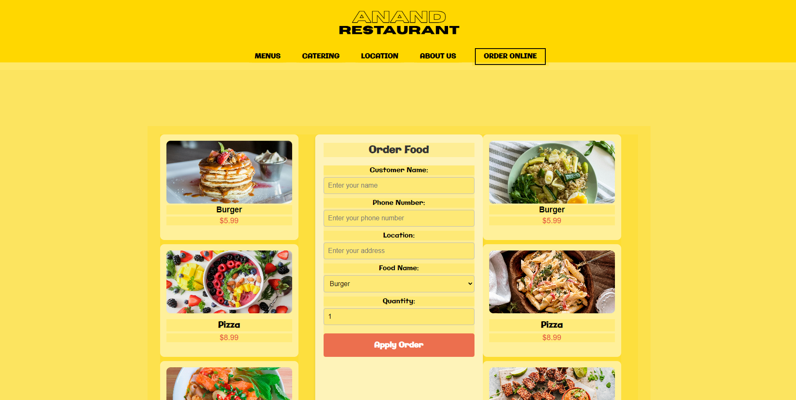

  
<h1>Restraunt-Websitet</h1>

  &#xa0;

>Crafting experiences, one line of code at a time.
  

 The following tools were used in this project:

- [HTML](https://developer.mozilla.org/en-US/docs/Web/HTML)
- [CSS](https://developer.mozilla.org/en-US/docs/Web/CSS)

## :checkered_flag: Welcome Page ##

-consists of github profile Image and Bio  

## Menu
-Top Foods . Nothing Special!!

## Order Page

<a href="#top">Back to top</a>
