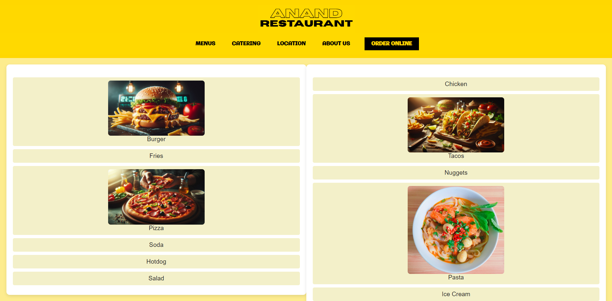
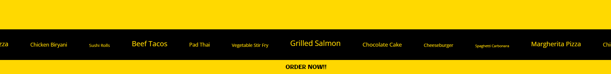

  <h1>ğŸ½ï¸ Gourmet Delights Restaurant</h1>
  
<em>Crafting culinary experiences, one line of code at a time.</em>

  
  
  

  <h2>✨ Features</h2>

  <h3>🠠Welcome Page</h3>
  
Our dynamic homepage features an interactive experience with:

  

    🟡 Elegant Slideshow Menu-Card
    🟡 Modern Grid-Based Menu Layout
    🟡 Responsive Design
  

  <h3>📸 Preview Screenshots</h3>

#### ✨ Slideshow Menu

#### ğŸ½ï¸ Menu Cards

#### 📋 Grid Menu

#### 🳠Menu Section

Discover our carefully curated selection of top dishes, where every item is special!

#### ğŸ›ï¸ Order System

Seamless ordering experience with our user-friendly interface

#### 📢 Interactive Footer

Dynamic marquee footer with hover effects

 

  

    <a href="#top">â¬†ï¸ Back to Top</a>
  

  

    <small>Made with â¤ï¸ for food lovers</small>
  

